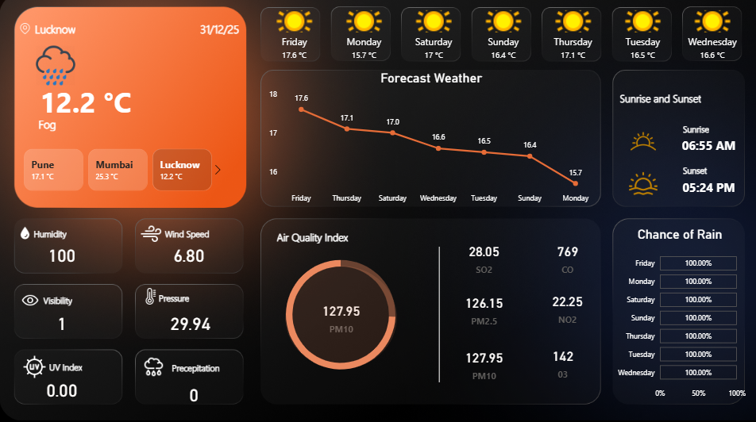

# Weather_Analytics_Dashboard_PowerBI
## Weather Forecasting and Air Quality Analytics Dashboard

**Author:** Samiksha Kamath  
**Date Created:** June 2025 

---

## Business Question
Weather data is widely available, but raw meteorological information is often fragmented and difficult to interpret for decision-making.  
The core business problem is the lack of an integrated view of weather conditions, short-term forecasts, and air quality indicators.

**This project answers the key business question:**  
How can weather conditions, forecast trends, and air quality metrics be consolidated to enable effective monitoring and informed planning?

---

## Why This Analysis Is Needed
Weather conditions directly impact transportation, public health, operations planning, and daily decision-making. Without structured analytics, users rely on isolated data points rather than trend-based insights.

This dashboard is designed to:

- Provide a centralized view of current and forecasted weather conditions  
- Enable short-term temperature trend analysis  
- Monitor atmospheric and air quality indicators  
- Support planning based on environmental and forecast data  

The objective is **actionable interpretation**, not raw data display.

---

## Dataset Overview
The analysis uses weather and environmental data containing:

- Current temperature and weather conditions  
- Multi-day weather forecasts  
- Humidity, wind speed, pressure, and visibility  
- Air Quality Index (AQI) metrics (PM10, PM2.5, NO2, SO2, CO, O3)  
- Sunrise and sunset timings  
- Precipitation levels and rain probability  

---

## Dashboard Sections Explained

### 1. Current Weather Summary
Displays current location, temperature, and prevailing weather conditions.

**Purpose:**  
Provide an at-a-glance understanding of current weather status.

---

### 2. Multi-Day Weather Forecast
Shows forecasted temperatures and conditions across upcoming days.

**Purpose:**  
Identify short-term temperature trends and expected weather patterns.

---

### 3. Atmospheric Conditions
Includes humidity, wind speed, visibility, pressure, UV index, and precipitation.

**Purpose:**  
Support environmental condition monitoring and comparative analysis.

---

### 4. Air Quality Index (AQI)
Visual representation of air quality levels with pollutant-specific breakdowns.

**Purpose:**  
Assess environmental health risks and pollution exposure.

---

### 5. Sunrise and Sunset Timings
Displays daily sunrise and sunset information.

**Purpose:**  
Support time-based planning and daylight analysis.

---

### 6. Chance of Rain
Shows precipitation probability across forecasted days.

**Purpose:**  
Enable planning based on rainfall likelihood.

---

## Key Analysis Insights
- Short-term temperature trends show gradual variation rather than extreme shifts  
- High humidity and low visibility correlate with fog-prone conditions  
- Particulate matter is a key contributor to air quality risk  
- Rain probability remains consistently high across forecasted days  
- Environmental indicators highlight the need for continuous monitoring  

---

## Business Recommendations

**Centralized Monitoring**  
Adopt a unified dashboard to replace fragmented weather data sources.

**Short-Term Planning Support**  
Leverage forecast trends for operational and scheduling decisions.

**Environmental Risk Awareness**  
Monitor AQI metrics to assess potential health and environmental impacts.

**Trend-Based Decision-Making**  
Prioritize trend analysis over single-point observations.

---

## Tools & Technologies
- Power BI  
- DAX  
- Data Modeling and Visualization  

---

## Outcome
This dashboard converts complex weather and environmental data into a structured analytical view, enabling effective monitoring, short-term forecasting, and informed decision-making.
